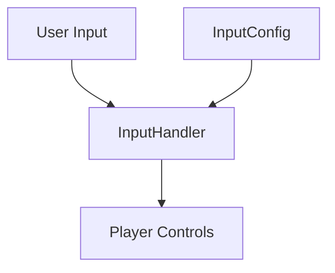

# YouTube Shorts Compilations

## Input Handling System

### Overview
The input system handles three types of user interactions:
- Mouse wheel scrolling
- Touch swipes
- Keyboard navigation

### Architecture


### Quick Start
```javascript
import { InputHandler, InputConfig } from './input-handler';

const player = new Player();
const inputHandler = new InputHandler(player, InputConfig);
```